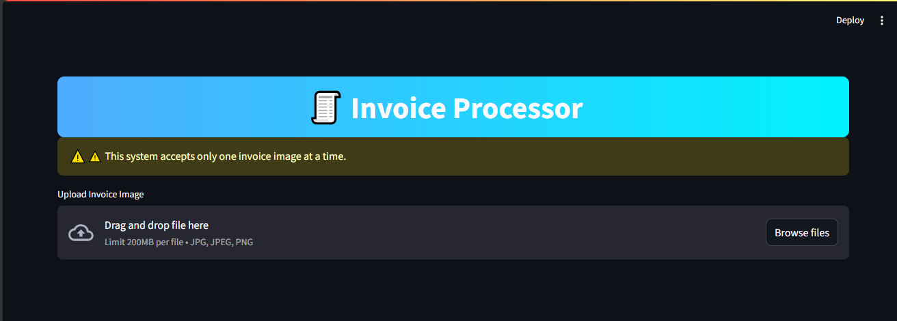
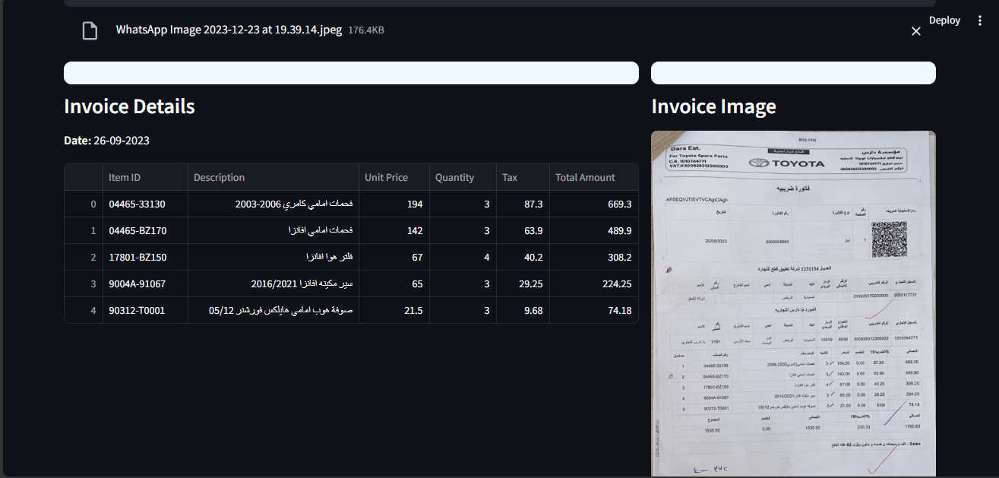

# Invoice Processor

A modern end-to-end system for automatic invoice data extraction using state-of-the-art LLM (Gemini) and a friendly web interface.  
This solution enables you to upload a scanned invoice image and instantly obtain structured, export-ready data in table format.

---

## Features

* **Automated Invoice Data Extraction:**

  * Extracts key fields: Item ID, Item Description, Unit Price, Quantity, Tax, Total Amount, and Invoice Date.
  * Supports both English and Arabic invoices.

* **LLM Gemini Integration:**

  * Utilizes Gemini API for advanced OCR and data structuring directly from images.

* **User-Friendly Web UI:**

  * Built with Streamlit for easy, no-code usage. Drag and drop your invoice, view data instantly.

* **Export-Ready Tables:**

  * Data displayed in clear tables, ready for export to CSV or Excel for further processing.

---

## Project Structure

```
.
├── api.py             # FastAPI backend API
├── invoice_parser.py  # Invoice extraction logic (Gemini integration)
├── streamlit_app.py   # Streamlit frontend
├── requirements.txt   # Project dependencies
├── .env               # Gemini API key (not included in repo)
├── .gitignore         # Git ignored files (incl. .env)
└── screenshots/       # Demo screenshots (add yours here)
```

---

## Demo

### Invoice Upload



### Extracted Invoice Data



---

## Getting Started

### 1. Clone the repository

```bash
git clone [repository_link]
cd [project_folder]
```

### 2. Create and activate a Python virtual environment

```bash
conda create --name invoice-processor python=3.10 -y
conda activate invoice-processor
```

*Or use `python -m venv venv && source venv/bin/activate` if you prefer virtualenv.*

### 3. Install dependencies

```bash
pip install -r requirements.txt
```

### 4. Configure your Gemini API key

Create a file named `.env` in the root project directory and add your Gemini API key:

```
GEMINI_API_KEY="your_gemini_api_key"
```

> **Note:** `.env` is excluded from version control via `.gitignore` and must be created manually.

### 5. Start the backend API server

```bash
uvicorn api:app --reload
```

The FastAPI backend will be available at `http://localhost:8000`.

### 6. Run the Streamlit frontend

Open a new terminal (with the virtual environment activated) and run:

```bash
streamlit run streamlit_app.py
```

By default, the app will launch at `http://localhost:8501` in your browser.

---

## Usage

1. Upload an invoice image (`.jpg`, `.jpeg`, or `.png`) via the Streamlit UI.
2. Wait for processing (Gemini LLM will extract and structure the data).
3. View and export your results in table format.

---

## Technologies Used

| Technology     | Purpose                                                         |
| -------------- | --------------------------------------------------------------- |
| Python         | Main programming language                                       |
| Streamlit      | Interactive web interface                                       |
| FastAPI        | Backend REST API                                                |
| Gemini LLM API | Intelligent data extraction and structuring from invoice images |
| Pandas         | Data handling and tabular presentation                          |
| json\_repair   | Robust JSON parsing from LLM responses                          |
